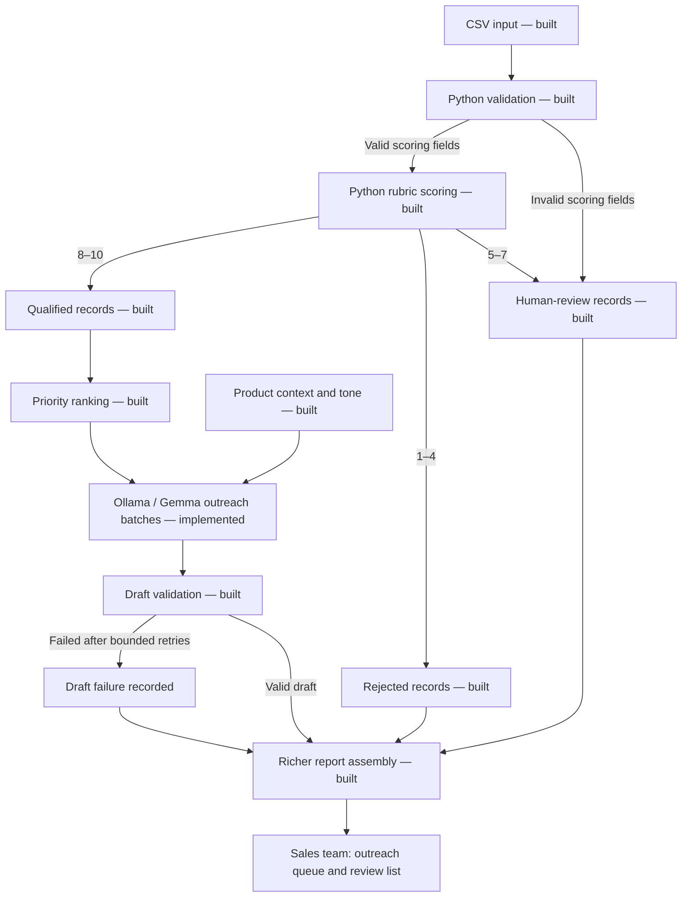
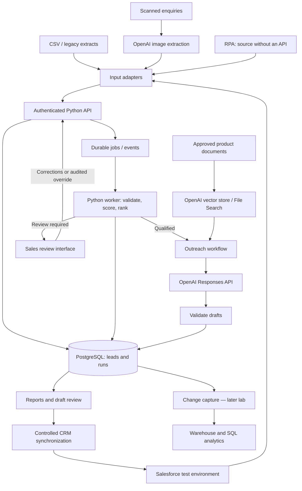
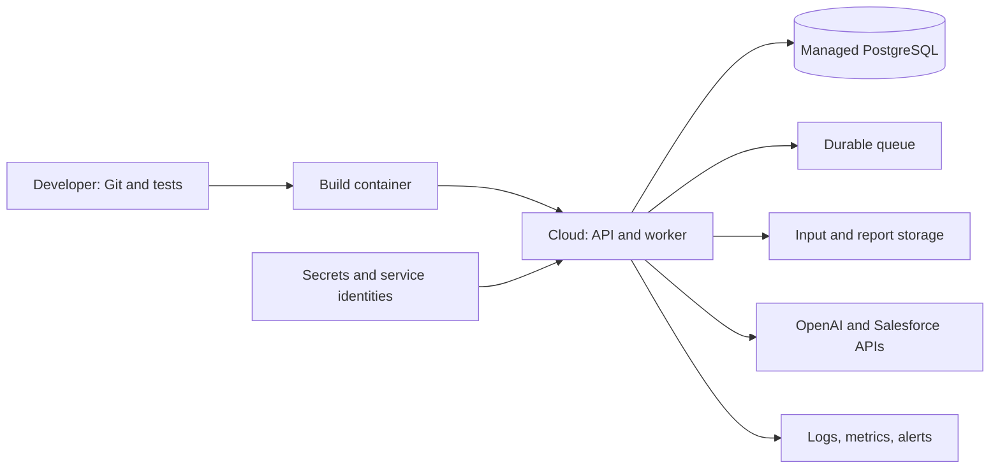

# Lead Intelligence System

> **Current direction — October 5, 2026:** By user choice, Python now targets local
> Gemma `gemma3:4b` through Ollama for outreach; qualification remains in Python.
> The verified local run produced 5 drafts; user/sales review remains. See
> [OUTREACH_SETUP.md](OUTREACH_SETUP.md) for current commands. Earlier OpenAI
> request/setup details below are historical and superseded for this stage;
> RAG, agent, and cloud portfolio extensions still need separate planning.

## End-to-end architecture

**Design date:** October 1, 2026  
**Primary stack:** Python + Ollama/Gemma; PostgreSQL and Salesforce added later.  
**Scope:** Assignment first, FDE portfolio extensions second.

> Python owns qualification rules. Local Gemma generates outreach drafts.
> The system produces outreach drafts; automatic email sending is not included.

---

## 1. Assignment architecture

**Built:** CSV intake, validation, scoring, decisions, priority queue, batched local outreach, output checks, and richer JSON reports.  
**Verified local run:** 5 drafts in 3 calls with zero failures.  
**Pending:** User/sales draft review and the 100-lead demonstration.

Existing JSON reports contain scores and reasons. Report assembly also includes
ranked queues, drafts, aggregate statistics, and failure summaries.

### Qualification and ranking

- Score = 1 + company size (0 or 4) + source (0–3) + recency (0–2).
- Target company size: 20–500, inclusive; this is a campaign assumption.
- 8–10 qualified; 5–7 human review; 1–4 rejected for this campaign.
- Missing company size: warning plus zero size points.
- Invalid size, or missing/invalid source or date: review with a null score.
- Missing name, company, or industry: warning; do not invent details in drafts.
- Qualified leads rank by score descending, interaction date descending, then CSV order.
- Sample evaluation date: 2024-01-20, configurable through --as-of.

See project_approach.md for the complete points table.

### Ollama request boundary

Send qualified leads to `http://127.0.0.1:11434/api/chat`, with model `gemma3:4b`,
`stream: false`, and the draft JSON schema in `format`. Include stable lead IDs,
product context, and tone instructions. Match each response to its input identifier.
Validate completeness, duplicate identifiers, unsupported claims, and missing-field
handling. Local requests require no API key; there is no automatic cloud fallback.

Use a draft status separate from the qualification decision. An API timeout must
not turn a qualified lead into a rejected lead.

Default to two qualified leads per request and a 180-second timeout; adjust using
`--batch-size` and `--request-timeout` based on measured latency. This is
application-level batching. OpenAI remains an explicit optional provider only.

---

## 2. Portfolio architecture

Everything in this view beyond the existing Python core is planned.

The outreach workflow starts as ordinary Python. The later Agents SDK exercise
coordinates retrieval, drafting, and checks through constrained tools. It reuses
the same scoring functions rather than implementing a second set of rules.

CRM synchronization updates designated output fields only. Prevent feedback loops
by distinguishing source changes from our own writebacks.

---

## 3. Components and responsibilities

| Component | Technology / choice | Responsibility |
| :--- | :--- | :--- |
| Entry point | Python CLI; built | Run the assignment locally |
| Rules | Python; built | Validate, score, explain |
| API layer | FastAPI proposed | Accept runs and expose results |
| Contract validation | Pydantic proposed | Validate API and model payloads |
| AI client | Local Ollama HTTP via Python standard library; implemented | Request and validate Gemma draft batches |
| Retrieval | OpenAI File Search; extension | Retrieve approved product context |
| Orchestration | OpenAI Agents SDK; extension | Coordinate tools and checks |
| Operational storage | PostgreSQL; extension | Persist records, results, and audit history |
| CRM adapter | Salesforce REST API; extension | Read leads and synchronize approved fields |
| Events | Durable queue; provider undecided | Retry and decouple long-running work |
| iPaaS | Select when implementing | Manage an enterprise integration exercise |
| Legacy automation | One RPA platform; undecided | Collect data when no suitable API exists |
| Packaging | Docker proposed | Package the application consistently |
| Cloud | Provider undecided | Host API, workers, storage, and monitoring |

FastAPI, Pydantic, and Docker are proposed implementation choices, not installed or
completed components. No cloud resources are provisioned by this document.

---

## 4. Data model and interfaces

### Consistent lead record

Map every input into the same fields:

- Identity: lead_id, source_system, source_record_id.
- Original data: name, company, company_size, industry, source, last_interaction_date.
- Provenance: ingestion time, input row or document reference, schema version.

Do not use the person's name as a unique identifier. CSV rows need a run-scoped ID;
CRM records use their source-system identity. Retain the original input for audit.

### Proposed PostgreSQL tables

| Table | Main contents |
| :--- | :--- |
| leads | Canonical identity and current attributes |
| runs | Evaluation date, rubric version, status, timestamps |
| assessments | Run ID, lead ID, input snapshot, score, breakdown, decision, rank |
| outreach_drafts | Assessment ID, text, model/prompt version, references, draft status |
| review_actions | Reviewer, reason, correction or override, timestamp |
| processing_events | Attempts, errors, event IDs, correlation IDs |

Keep historical assessments immutable. Corrections create a new assessment or an
explicitly recorded human override. Never silently rewrite past decisions.

### Proposed API boundaries

- POST /runs: submit a batch or input reference; return a run identifier.
- GET /runs/{run_id}: processing status and counts.
- GET /runs/{run_id}/report: decisions, queues, reasons, and drafts.
- POST /leads/{lead_id}/reviews: authorized correction or override.

These are proposed interfaces. The assignment continues to work through the CLI.

---

## 5. Human review and failure recovery

### Human review

The assignment exports a review list. The portfolio version adds a review interface.
A reviewer can correct missing data or record a justified override. Valid corrected
data is evaluated again using the same versioned rules.

### Failure behavior

| Failure | Expected behavior |
| :--- | :--- |
| Missing CSV headers | Stop clearly before processing |
| Invalid lead fields | Preserve the record; route to review |
| API timeout or rate limit | Bounded retry with backoff; record unresolved failures |
| Missing, duplicate, or invalid model result | Reject the affected draft; retry or flag |
| Model refusal or incomplete response | Record draft status and continue other leads |
| Duplicate incoming event | Use idempotency tracking; avoid duplicate effects |
| Worker interruption | Resume persisted work without repeating completed side effects |
| Repeated event failure | Move to a failed-work queue for investigation |

Persist qualification results independently of drafting. Report whether a run
completed fully or with errors; do not hide failed drafts in success counts.

---

## 6. Deployment and operations

Choose the hosting provider after confirming account access and project needs.
SQL credentials and API keys remain server-side. Restrict review and CRM-write
permissions. Treat lead text and retrieved documents as data, not instructions.

Record run IDs, rubric/prompt/model versions, latency, token usage, estimated cost,
error counts, review backlog, and draft-quality results. Avoid placing unnecessary
personal data or secrets in logs. Define retention for uploaded documents and runs.

Use regression checks before prompt or rubric changes, and retain a rollback path.
CDC and warehouse reporting are later learning extensions, not prerequisites for
processing 100 leads.

---

## 7. Build order and acceptance checks

1. **Existing core:** Preserve verified validation and scoring behavior.
2. **Priority/report:** Verify deterministic ordering and counts across all outcomes.
3. **Local Gemma drafts:** Review live output; ensure every draft maps to one qualified lead.
4. **Assignment evaluation:** Process 100+ records; exercise failures; finish README.
5. **SQL and API:** Persist runs and expose authenticated interfaces.
6. **Salesforce:** Test round-trip mapping and duplicate/loop prevention.
7. **RAG:** Check retrieval relevance and whether claims match supplied evidence.
8. **Agents:** Add tool orchestration without changing qualification authority.
9. **Multimodal:** Test extraction errors and validation of extracted fields.
10. **Cloud:** Deploy with secrets, access control, logs, and reproducible setup.
11. **Events/iPaaS/RPA:** Demonstrate reliable integration and a legacy workflow.
12. **CDC/analytics/operations:** Show traceable updates, monitoring, UAT, and handover.

**Known baseline:** 29 training leads and 23 testing leads, totaling 52 records.
At `2024-01-20`, testing decisions are 5 qualified, 13 review, and 5 rejected.

---

## 8. JD coverage and limits

**JD_1:** Demonstrates Python, SQL, LLMs, RAG, agents, APIs, canonical data models,
automation, events, cloud, and operational practices. Use a later insurance intake
exercise for domain learning. A simulated legacy extract does not establish live
mainframe experience, and this portfolio does not substitute for years of delivery.

**JD_2:** Demonstrates transferable prototyping, multimodal, prompt, integration,
and evaluation skills. Gemini, Vertex AI, Google ADK, and Gemini Enterprise remain
separate hands-on gaps; OpenAI tools do not count as experience in those products.
Certifications remain separate milestones.

## References

- [Project approach](project_approach.md)
- [Training log](FDE_Training_Log.md)
- [Ollama local API](https://docs.ollama.com/api/introduction)
- [Ollama structured outputs](https://docs.ollama.com/capabilities/structured-outputs)
- [OpenAI Structured Outputs](https://developers.openai.com/api/docs/guides/structured-outputs)
- [OpenAI File Search](https://developers.openai.com/api/docs/guides/tools-file-search)
- [OpenAI Agents SDK](https://developers.openai.com/api/docs/guides/agents/sdk)
